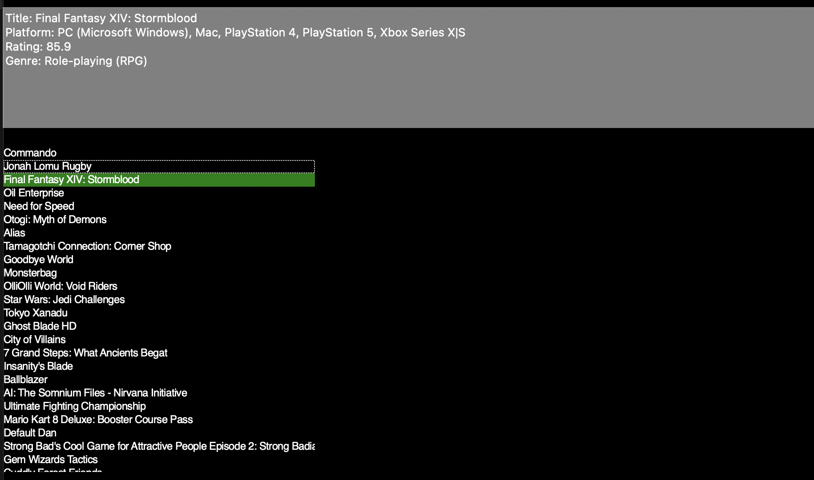

# Game Search Engine

This repository contains the source code and documentation for the **Game Search Engine** project. The application allows users to explore, search, and visualize video game data through a graphical user interface (GUI).

<h2> Table of Contents </h2>

- [Overview](#overview)
- [Getting Started](#getting-started)
  - [Installation](#installation)
  - [Usage](#usage)
- [Features](#features)
  - [Search for Games](#search-for-games)
  - [Game Listing](#game-listing)
  - [Visualizations](#visualizations)
  - [Top-rated Games by Genre](#top-rated-games-by-genre)


---

## Overview

The **Game Search Engine** fetches video game data from the [IGDB API](https://api-docs.igdb.com/), allowing users to explore game information such as titles, platforms, genres, and ratings. With features like game search, data visualization, and top-rated game recommendations, the application serves as a robust platform for exploring game data.



---

## Getting Started

### Installation

1. Clone the repository:

   ```bash
   git clone https://github.com/your-username/Game-Search-Engine.git
   cd Game-Search-Engine
2. Set up a Python virtual environment:

   ```bash
   python3 -m venv venv
   source venv/bin/activate
   ```
3. Install the required dependencies:

   ```bash
   pip install -r requirements.txt
   ```
### Usage
Run the application in your IDE or terminal using the following command:

```bash
python main.py
```
Once the application is running, you can interact with the GUI to:
- Search for games
- Explore a database of video games
- Visualize game data
- View top-rated games by genre
### Features
#### Search for Games
The search feature allows users to search for games by title. The search results are displayed in a list format, showing the game title, platform, and rating.
#### Game Listing
The application provides a list of video games, including details such as the title, platform, genre, and rating. Users can scroll through the list to explore different games.
#### Visualizations
The application offers visualizations such as:
- Number of games per platform
- Number of games per genre
- Average rating per genre
#### Top-rated Games by Genre
Users can view a list of top-rated games by genre, showing the game title, platform, and rating.

